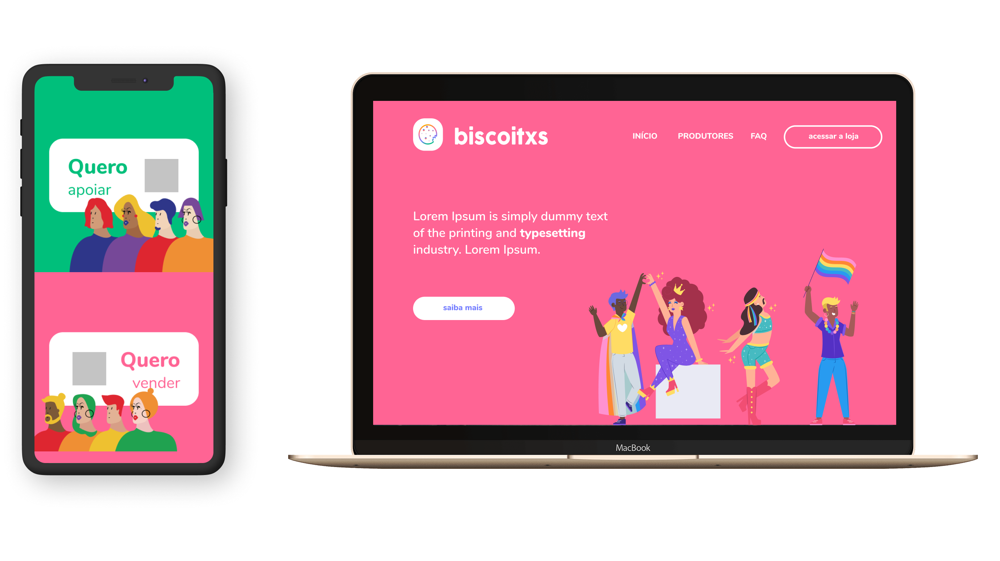
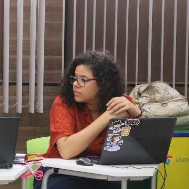

<h1 align="center">
  
</h1>

<h4 align="center">
  Merecemos biscoitos :cookie:
</h4>

  <a href="#ghost-tecnologias">Tecnologias</a>&nbsp;&nbsp;&nbsp;|&nbsp;&nbsp;&nbsp;
  <a href="#computer-projeto">Projeto</a>&nbsp;&nbsp;&nbsp;|&nbsp;&nbsp;&nbsp;
  <a href="#rocket-iniciando-aplicação">Iniciando aplicação</a>&nbsp;&nbsp;&nbsp;|&nbsp;&nbsp;&nbsp;
  <a href="#time">Time</a>

 

  

## :ghost: Tecnologias

Esse projeto foi desenvolvido com as seguintes tecnologias:

- [React.js](https://pt-br.reactjs.org/)
- [Node.js](https://nodejs.org/en/)
- [AdonisJS](https://adonisjs.com/)
- [Docker](https://docs.docker.com/)
- [Postgres](https://www.postgresql.org/)

## :computer: Projeto

O projeto <a href="https://biscoitxs.netlify.app/" alt="Biscoitxs">Biscoitxs</a> consiste na proposta de desafio do #ficaemcasahack, onde, juntas pensamos em como desenvolver uma ideia de market place para divulgação, capacitação e crescimento profissional da comunidade lgbtqia+.

## :rocket: Iniciando aplicação

- Configure o frontend em: <a href="https://github.com/brendamatias/biscoitxs">Frontend</a>
- Clone este repositório usando `git clone https://github.com/brendamatias/biscoitxs-api`;
- Mova-se para diretório da aplicação: `cd biscoitxs-api`;
- Execute `yarn install` ou `npm install` para instalar as dependências;
- Duplique o arquivo `.env.example` para `.env` para leitura das variáveis;
- Instale o AdonisJs caso necessário: `npm i -g @adonisjs/cli`;
- Execute o seguinte comando para executar as migrações: `adonis migration:run`;
- Gere a chave da sua aplicação: `adonis key:generate`;
- Inicie a aplicação: `adonis serve --dev`;

## Team

Time de pessoas maravilhosa ([emoji key](https://allcontributors.org/docs/en/emoji-key)):

<table>
  <tr>
    <td align="center">
      <a href="https://www.linkedin.com/in/alessa-alves-/">
        
         
        <b>Alessa Alves</b>
      </a>
       
      <a href="https://github.com/alessaalves"title="Project Management">📆</a>
    </td>
    <td align="center">
      <a href="https://www.linkedin.com/in/brenda-matias/">
        
         
        <b>Brenda Matias</b>
      </a>
       
      <a href="https://github.com/brendamatias"title="Code">💻</a>
    </td>
    <td align="center">
      <a href="https://www.linkedin.com/in/fabiana-barros-e-silva-3317281a4">
        
         
        <b>Fabiana Barros e Silva</b>
      </a>
       
      <a href="https://www.linkedin.com/in/fabiana-barros-e-silva-3317281a4" title="Content">🖋</a>
    </td>
    <td align="center">
      <a href="https://www.linkedin.com/in/nelkisamatias/">
        
         
        <b>Nelkisa Matias</b>
      </a>
       
      <a href="https://github.com/gabriias"title="Code">💻</a>
    </td>

  </tr>
</table>
